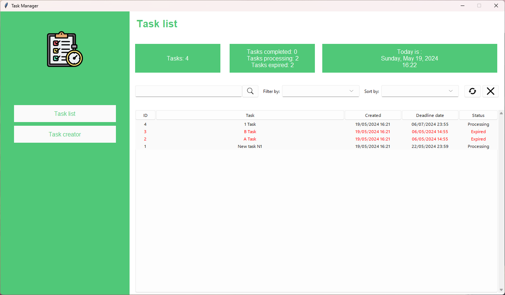
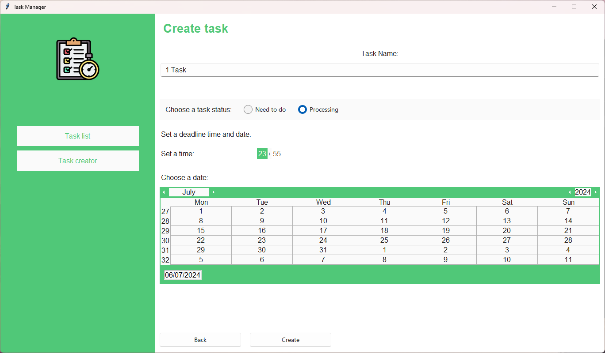
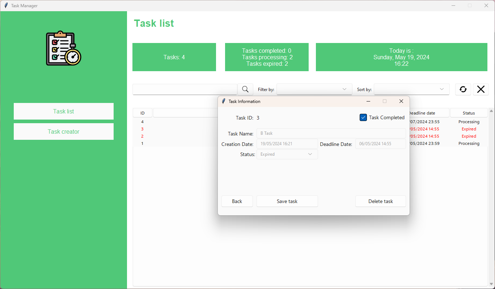

# Task Manager

### Description:

The Task Manager is a desktop application designed for managing tasks efficiently. Built using Python with Tkinter for the GUI and SQLite for the database, this application supports essential CRUD (Create, Read, Update, Delete) operations on tasks. It provides a user-friendly interface for users to create, update, delete, and filter tasks.
### Key Features:

- Task Addition: Users can create new tasks with specific details such as task name, creation date, deadline, and status.

-  Task Deletion: The application allows users to delete tasks, ensuring easy management and maintenance of the task list.

- Task Update: Users can update task details, including changes in task name, deadlines, and status (e.g., from "Need to do" to "Completed").

- Task Display: The system displays tasks in a clear, organized format within a tree view, showcasing important details such as task ID, name, creation date, deadline, and status.

- Task Filtering and Sorting: Users can filter tasks based on their status (e.g., "Need to do", "Completed", "Processing") and sort them by various criteria (e.g., task ID, alphabetic order, status, creation date, deadline date).

- Task Status Monitoring: The application provides real-time updates and statistics on the number of tasks, tasks completed, tasks in processing, and tasks expired.

-  Deadline Management: The application highlights expired tasks in red and alerts users if they try to set a deadline in the past.
### Technologies Used:

- Python: The core programming language used to develop the application.
- Tkinter: Utilized for creating the graphical user interface.
- SQLite: The database system used to store task data.
- PIL: Used for handling images within the application.
- kcalendar: Provides a calendar widget for selecting dates.
- tktimepicker: Allows users to select times in a user-friendly way.
- sv_ttk: A modern theme for Tkinter to enhance the UI.
### How to Run the Project:

1. Clone the repository from GitHub.
1. Navigate to the project directory.
1. Execute run button to launch the application locally.

### App screenshot:

